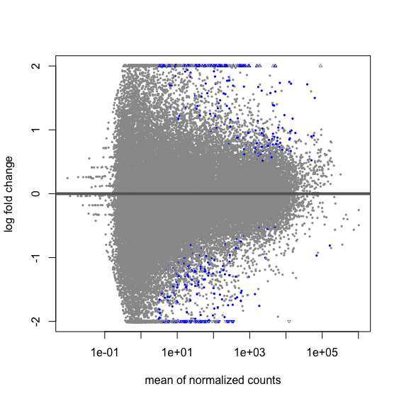

# Final Project Outline

## Title
Differential Gene Expression in TCGA within stage 1-4 Ovarian Serous Cystadenocarcinoma comparing radiation treatment vs. non-radiation treatment using DeSEQ2

## Author
Shanna Badhesha

## Overview of the Project
I will identify differentially expressed genes between Ovarian Serous Cystadenocarcinoma radiation treatment using carboplatin vs. non-radiation treatment without carboplatin. This analysis will utilize the package DeSEQ2 and the http://bioconductor.org/packages/release/bioc/vignettes/DESeq2/inst/doc/DESeq2.html vignette. For this analysis, I will be using the TCGA-OV cohort. I have identified a total of 40 STAR-counts files with 20 radiation treatment and 20 non-radiation treatment files. 

## Data
I will use the data from the following website: https://portal.gdc.cancer.gov/repository. There are 585 STAR-count files with 450 radiation treatment and 135 non-radiation treatment files in total. I will be using 40 STAR-counts files with 20 samples per group. The specific files are available [here](https://portal.gdc.cancer.gov/repository?facetTab=files&filters=%7B%22op%22%3A%22and%22%2C%22content%22%3A%5B%7B%22op%22%3A%22in%22%2C%22content%22%3A%7B%22field%22%3A%22cases.primary_site%22%2C%22value%22%3A%5B%22ovary%22%5D%7D%7D%2C%7B%22op%22%3A%22in%22%2C%22content%22%3A%7B%22field%22%3A%22cases.project.program.name%22%2C%22value%22%3A%5B%22TCGA%22%5D%7D%7D%2C%7B%22op%22%3A%22in%22%2C%22content%22%3A%7B%22field%22%3A%22files.analysis.workflow_type%22%2C%22value%22%3A%5B%22STAR%20-%20Counts%22%5D%7D%7D%2C%7B%22op%22%3A%22in%22%2C%22content%22%3A%7B%22field%22%3A%22files.experimental_strategy%22%2C%22value%22%3A%5B%22RNA-Seq%22%5D%7D%7D%5D%7D).

## Milestone 1
I have downloaded the data and matched the file names to the corresponding TCGA IDs. I have isolated the necessary unstranded column from each file and merged them together for the analysis. I have created another spreadsheet identifying the TCGA IDs for each of the two treatment groups.

## Milestone 2
I will do an initial run of the entire vignette listed above for analysis. This will include having data loaded in (completed during milestone 1) and run through the entire vignette. I will be seeking feedback during this step. I will begin the process of uploading documentation and defining my results.

## Deliverable
Below is the completed vignette with my 40 samples. 

## Organzing Sample Files

The STAR-Count files provide a lot of information that I will not be needing for the analysis. For the purpose of this vignette, we will extract the unstranded gene count column from each file and merge them together.

Create a ```gene.id``` file that includes all the gene id's from one of the sample files: 
	```awk '{print $1}’ TCGA-04-1331.tsv > TCGA-04-1331.txt```

Extract the unstranded column (column 4) from each tsv file:
	```awk '{print $4}’ TCGA-04-1331.tsv > TCGA-04-1331.txt```

Remove the first 6 lines from each tsv file since they will not be needed for our analysis:
	```sed -i .bak '1,6d' 'TCGA-04-1332.txt'```

Add a header to each of the file using ```vi```. The header should be the sample ID. 

Merge the files together using the ```paste``` command: 
	```paste gene.id *.txt > merged_files.txt```

### Sample Information Table 

Create a .txt file using Microsoft Excel with the Sample IDs and their condition. The Sample IDs should be in the same order as the merged_file.txt otherwise DESeq2 will not accept the file. 

## DESeq2 Vignette

### Count matrix input
Load in DESeq2. The function DESeqDataSetFromMatrix can be used if you already have a matrix of read counts prepared from another source. Another method for quickly producing count matrices from alignment files is the featureCounts function (Liao, Smyth, and Shi 2013) in the Rsubread package. To use DESeqDataSetFromMatrix, the user should provide the counts matrix, the information about the samples (the columns of the count matrix) as a DataFrame or data.frame, and the design formula.

```r
library("DESeq2")


file <- read.delim(file= "Desktop/Final_project/merged_files.txt", header = TRUE, sep = "\t", row.names = "X")
cts <- as.matrix(file)                 
coldata <- read.delim(file= "Desktop/Final_project/TCGA_groups.txt", header = TRUE, sep = "\t", row.names=1) 
all(rownames(coldata) %in% colnames(cts))
```
    ## [1] TRUE
   
```r
all(rownames(coldata) == colnames(cts))
```
    ## [1] TRUE
```r
cts <- cts[,rownames(coldata)]
all(rownames(coldata) == colnames(cts))
```
    ## [1] TRUE

We examine the count matrix and column data to see if they are consistent in terms of sample order.

```r
head(cts,2)
```
    ##                   TCGA.04.1331 TCGA.04.1332 TCGA.04.1338 TCGA.04.1341 TCGA.04.1343 TCGA.04.1347 TCGA.04.1350
    ##ENSG00000000003.15         6932         2495         1262         3957         3726         5462         4687
    ##ENSG00000000005.6            10           12            1            8          185           13            0
    ##                   TCGA.04.1356 TCGA.04.1357 TCGA.04.1361 TCGA.04.1362 TCGA.04.1364 TCGA.04.1365 TCGA.04.1514
    ##ENSG00000000003.15         5423         2130         7111        12071         5130         5787        18147
    ##ENSG00000000005.6             2            3           42            6            5            6          158
    ##                   TCGA.04.1519 TCGA.04.1530 TCGA.04.1536 TCGA.04.1542 TCGA.04.1648 TCGA.04.1651 TCGA.04.1655
    ##ENSG00000000003.15         7414         1519         1401         3181         9861         8024         6103
    ##ENSG00000000005.6             1            9            7            9            5           49           55
    ##                   TCGA.09.0364 TCGA.09.0366 TCGA.09.1659 TCGA.09.2048 TCGA.09.2056 TCGA.10.0928 TCGA.13.0730
    ##ENSG00000000003.15         6595        13998         5339        13953         3810         4327         3218
    ##ENSG00000000005.6            15           16            6           14            0           14         1244
    ##                   TCGA.13.0762 TCGA.13.0765 TCGA.13.0766 TCGA.13.0800 TCGA.13.0916 TCGA.13.0920 TCGA.13.0923
    ##ENSG00000000003.15         5838         4273         2143         5905        15855         3566         2008
    ##ENSG00000000005.6             1            1            5           68          823            7            2
    ##                   TCGA.13.1403 TCGA.13.1505 TCGA.13.1507 TCGA.13.2060 TCGA.23.1029
    ##ENSG00000000003.15         2875         5474         2561         6388         9557
    ##ENSG00000000005.6             1           49            9           37          153
```r
coldata
```

    ##             condition
    ##TCGA.04.1331       rad
    ##TCGA.04.1332       rad
    ##TCGA.04.1338       rad
    ##TCGA.04.1341   non-rad
    ##TCGA.04.1343       rad
    ##TCGA.04.1347       rad
    ##TCGA.04.1350       rad
    ##TCGA.04.1356       rad
    ##TCGA.04.1357   non-rad
    ##TCGA.04.1361       rad
    ##TCGA.04.1362       rad
    ##TCGA.04.1364       rad
    ##TCGA.04.1365       rad
    ##TCGA.04.1514       rad
    ##TCGA.04.1519   non-rad
    ##TCGA.04.1530       rad
    ##TCGA.04.1536       rad
    ##TCGA.04.1542       rad
    ##TCGA.04.1648       rad
    ##TCGA.04.1651       rad
    ##TCGA.04.1655       rad
    ##TCGA.09.0364       rad
    ##TCGA.09.0366       rad
    ##TCGA.09.1659   non-rad
    ##TCGA.09.2048   non-rad
    ##TCGA.09.2056   non-rad
    ##TCGA.10.0928   non-rad
    ##TCGA.13.0730   non-rad
    ##TCGA.13.0762   non-rad
    ##TCGA.13.0765   non-rad
    ##TCGA.13.0766   non-rad
    ##TCGA.13.0800   non-rad
    ##TCGA.13.0916   non-rad
    ##TCGA.13.0920   non-rad
    ##TCGA.13.0923   non-rad
    ##TCGA.13.1403   non-rad
    ##TCGA.13.1505   non-rad
    ##TCGA.13.1507   non-rad
    ##TCGA.13.2060   non-rad
    ##TCGA.23.1029   non-rad 


### Building the DESeqDataSet
With the count matrix, cts, and the sample information, coldata, we can construct a DESeqDataSet:

```r
dds <- DESeqDataSetFromMatrix(countData = cts,
                              colData = coldata,
                              design = ~ condition)

`dds
```
    ##class: DESeqDataSet 
    ##dim: 60660 40 
    ##metadata(1): version
    ##assays(1): counts
    ##rownames(60660): ENSG00000000003.15 ENSG00000000005.6 ... ENSG00000288674.1 ENSG00000288675.1
    ##rowData names(0):
    ##colnames(40): TCGA.04.1331 TCGA.04.1332 ... TCGA.13.2060 TCGA.23.1029
    ##colData names(1): condition

### Pre-Filtering
While it is not necessary to pre-filter low count genes before running the DESeq2 functions, there are two reasons which make pre-filtering useful: by removing rows in which there are very few reads, we reduce the memory size of the dds data object, and we increase the speed of the transformation and testing functions within DESeq2. It can also improve visualizations, as features with no information for differential expression are not plotted.

Here we perform a minimal pre-filtering to keep only rows that have at least 10 reads total. Note that more strict filtering to increase power is automatically applied via independent filtering on the mean of normalized counts within the results function.

```r
keep <- rowSums(counts(dds)) >= 10
dds <- dds[keep,]
```

### Factor
By default, R will choose a reference level for factors based on alphabetical order. Then, if you never tell the DESeq2 functions which level you want to compare against (e.g. which level represents the control group), the comparisons will be based on the alphabetical order of the levels. There are two solutions: you can either explicitly tell results which comparison to make using the contrast argument (this will be shown later), or you can explicitly set the factors levels. In order to see the change of reference levels reflected in the results names, you need to either run DESeq or nbinomWaldTest/nbinomLRT after the re-leveling operation. 

```r
dds$condition <- factor(dds$condition, levels = c("rad","non-rad"))
```

### Differential expression analysis
The standard differential expression analysis steps are wrapped into a single function, DESeq. The estimation steps performed by this function are described below, in the manual page for ```?DESeq``` and in the Methods section of the DESeq2 publication (Love, Huber, and Anders 2014).

Results tables are generated using the function results, which extracts a results table with log2 fold changes, p values and adjusted p values. With no additional arguments to results, the log2 fold change and Wald test p value will be for the last variable in the design formula, and if this is a factor, the comparison will be the last level of this variable over the reference level (see previous note on factor levels). However, the order of the variables of the design do not matter so long as the user specifies the comparison to build a results table for, using the name or contrast arguments of results.

Details about the comparison are printed to the console, directly above the results table. The text, ```condition non-rad vs. rad```, tells you that the estimates are of the logarithmic fold change log2(rad/non-rad).

```r
dds <- DESeq(dds)
res <- results(dds)
res
```
    ##log2 fold change (MLE): condition non.rad vs rad 
    ##Wald test p-value: condition non.rad vs rad 
    ##DataFrame with 45641 rows and 6 columns
    ##                     baseMean log2FoldChange     lfcSE       stat    pvalue      padj
    ##                    <numeric>      <numeric> <numeric>  <numeric> <numeric> <numeric>
    ##ENSG00000000003.15  5253.9122     -0.0505555  0.196991 -0.2566384 0.7974579  0.945787
    ##ENSG00000000005.6     25.2649      0.9278340  0.608227  1.5254727 0.1271412  0.536655
    ##ENSG00000000419.13  3237.4165      0.0142636  0.192966  0.0739176 0.9410760  0.984920
    ##ENSG00000000457.14   676.9305      0.0751432  0.164663  0.4563460 0.6481412  0.891204
    ##ENSG00000000460.17   457.1319      0.4220209  0.217847  1.9372332 0.0527168  0.393108
    ##...                       ...            ...       ...        ...       ...       ...
    ##ENSG00000288663.1   54.255850       0.122303  0.243648   0.501965 0.6156920  0.876257
    ##ENSG00000288667.1    0.805876      -1.523881  0.743250  -2.050295 0.0403357        NA
    ##ENSG00000288670.1  272.987292      -0.167227  0.240384  -0.695663 0.4866399  0.812998
    ##ENSG00000288674.1   10.466399       0.499068  0.342389   1.457603 0.1449500  0.557620
    ##ENSG00000288675.1   37.388481       0.446755  0.245943   1.816497 0.0692941  0.436438

### Log fold change shrinkage for visualization and ranking
Shrinkage of effect size (LFC estimates) is useful for visualization and ranking of genes. To shrink the LFC, we pass the ```dds``` object to the function lfcShrink. Below we specify to use the apeglm method for effect size shrinkage (Zhu, Ibrahim, and Love 2018), which improves on the previous estimator.

We provide the ```dds``` object and the name or number of the coefficient we want to shrink, where the number refers to the order of the coefficient as it appears in ```resultsNames(dds)```.

```r
resultsNames(dds)
```
    ##[1] "Intercept"                "condition_non.rad_vs_rad"

```r
resLFC <- lfcShrink(dds, coef="condition_non.rad_vs_rad", type="apeglm")
resLFC
```
    ##log2 fold change (MAP): condition non.rad vs rad 
    ##Wald test p-value: condition non.rad vs rad 
    ##DataFrame with 45641 rows and 5 columns
    ##                     baseMean log2FoldChange      lfcSE    pvalue      padj
    ##                    <numeric>      <numeric>  <numeric> <numeric> <numeric>
    ##ENSG00000000003.15  5253.9122   -1.34247e-06 0.00144266 0.7974579  0.945787
    ##ENSG00000000005.6     25.2649    2.15299e+00 0.66318587 0.1271412  0.536655
    ##ENSG00000000419.13  3237.4165    4.11597e-07 0.00144265 0.9410760  0.984920
    ##ENSG00000000457.14   676.9305    3.87099e-06 0.00144264 0.6481412  0.891204
    ##ENSG00000000460.17   457.1319    1.68436e-05 0.00144271 0.0527168  0.393108
    ##...                       ...            ...        ...       ...       ...
    ##ENSG00000288663.1   54.255850    4.92564e-07 0.00144267 0.6156920  0.876257
    ##ENSG00000288667.1    0.805876   -2.98944e-06 0.00144269 0.0403357        NA
    ##ENSG00000288670.1  272.987292   -8.32522e-06 0.00144268 0.4866399  0.812998
    ##ENSG00000288674.1   10.466399    4.63382e-06 0.00144269 0.1449500  0.557620
    ##ENSG00000288675.1   37.388481    3.58464e-06 0.00144267 0.0692941  0.436438

### Speed-up and parallelization thoughts
```r
library("BiocParallel")
register(MulticoreParam(4))
```

### p-values and adjusted p-values
We can order our results table by the smallest p value:
```r
resOrdered <- res[order(res$pvalue),]
```
    ##log2 fold change (MLE): condition non.rad vs rad 
    ##Wald test p-value: condition non.rad vs rad 
    ##DataFrame with 45641 rows and 6 columns
    ##                    baseMean log2FoldChange     lfcSE      stat      pvalue        padj
    ##                   <numeric>      <numeric> <numeric> <numeric>   <numeric>   <numeric>
    ##ENSG00000227063.5   273.3264        3.07756  0.545694   5.63971 1.70335e-08 0.000521037
    ##ENSG00000134595.9   151.6636        4.35419  0.842949   5.16543 2.39888e-07 0.001908205
    ##ENSG00000211829.9    84.2302        2.82467  0.547227   5.16179 2.44600e-07 0.001908205
    ##ENSG00000170627.11  205.1259        3.32391  0.644412   5.15806 2.49528e-07 0.001908205
    ##ENSG00000171956.7   347.4535       -4.54621  0.896349  -5.07192 3.93818e-07 0.002409298
    ##...                      ...            ...       ...       ...         ...         ...
    ##ENSG00000254586.2          0              0         0         0           1          NA
    ##ENSG00000255140.1          0              0         0         0           1          NA
    ##ENSG00000255457.1          0              0         0         0           1          NA
    ##ENSG00000281961.1          0              0         0         0           1          NA
    ##ENSG00000286567.1          0              0         0         0           1          NA

We can summarize some basic tallies using the summary function.
```r
summary(res)
```
    ##out of 45628 with nonzero total read count
    ##adjusted p-value < 0.1
    ##LFC > 0 (up)       : 222, 0.49%
    ##LFC < 0 (down)     : 179, 0.39%
    ##outliers [1]       : 0, 0%
    ##low counts [2]     : 15052, 33%
    ##(mean count < 3)
    ##[1] see 'cooksCutoff' argument of ?results
    ##[2] see 'independentFiltering' argument of ?results
    ##How many adjusted p-values were less than 0.1?

```r
sum(res$padj < 0.1, na.rm=TRUE)
```
    ##[1] 401

The results function contains a number of arguments to customize the results table which is generated. You can read about these arguments by looking up ?results. Note that the results function automatically performs independent filtering based on the mean of normalized counts for each gene, optimizing the number of genes which will have an adjusted p value below a given FDR cutoff, alpha. Independent filtering is further discussed below. By default the argument alpha is set to 0.1. If the adjusted p value cutoff will be a value other than 0.1, alpha should be set to that value:

```r
res05 <- results(dds, alpha=0.05)
summary(res05)
```
    ##out of 45628 with nonzero total read count
    ##adjusted p-value < 0.05
    ##LFC > 0 (up)       : 80, 0.18%
    ##LFC < 0 (down)     : 52, 0.11%
    ##outliers [1]       : 0, 0%
    ##low counts [2]     : 9744, 21%
    ##(mean count < 1)
    ##[1] see 'cooksCutoff' argument of ?results
    ##[2] see 'independentFiltering' argument of ?results

```r
sum(res05$padj < 0.05, na.rm=TRUE)
```
    ##[1] 132

### Exploring and exporting results

### MA-plot
In DESeq2, the function plotMA shows the log2 fold changes attributable to a given variable over the mean of normalized counts for all the samples in the DESeqDataSet. Points will be colored red if the adjusted p value is less than 0.1. Points which fall out of the window are plotted as open triangles pointing either up or down.

```r
plotMA(res, ylim=c(-2,2))
```


```r
plotMA(resLFC, ylim=c(-2,2))
```


### Alternative shrinkage estimators

The moderated log fold changes proposed by Love, Huber, and Anders (2014) use a normal prior distribution, centered on zero and with a scale that is fit to the data. The shrunken log fold changes are useful for ranking and visualization, without the need for arbitrary filters on low count genes. The normal prior can sometimes produce too strong of shrinkage for certain datasets. In DESeq2 version 1.18, we include two additional adaptive shrinkage estimators, available via the type argument of lfcShrink. For more details, see ?lfcShrink

The options for type are:

apeglm is the adaptive t prior shrinkage estimator from the apeglm package (Zhu, Ibrahim, and Love 2018). As of version 1.28.0, it is the default estimator.
ashr is the adaptive shrinkage estimator from the ashr package (Stephens 2016). Here DESeq2 uses the ashr option to fit a mixture of Normal distributions to form the prior, with method="shrinkage".
normal is the the original DESeq2 shrinkage estimator, an adaptive Normal distribution as prior.
If the shrinkage estimator apeglm is used in published research, please cite:

Zhu, A., Ibrahim, J.G., Love, M.I. (2018) Heavy-tailed prior distributions for sequence count data: removing the noise and preserving large differences. Bioinformatics. 10.1093/bioinformatics/bty895

If the shrinkage estimator ashr is used in published research, please cite:

Stephens, M. (2016) False discovery rates: a new deal. Biostatistics, 18:2. 10.1093/biostatistics/kxw041

In the LFC shrinkage code above, we specified coef="condition_non.rad_vs_rad". We can also just specify the coefficient by the order that it appears in resultsNames(dds), in this case coef=2. For more details explaining how the shrinkage estimators differ, and what kinds of designs, contrasts and output is provided by each, see the extended section on shrinkage estimators.

```r
resultsNames(dds)
```
    ##[1] "Intercept"                "condition_non.rad_vs_rad"

```r
resNorm <- lfcShrink(dds, coef=2, type="normal")
resAsh <- lfcShrink(dds, coef=2, type="ashr")
```

```r
par(mfrow=c(1,3), mar=c(4,4,2,1))
xlim <- c(1,1e5); ylim <- c(-3,3)
plotMA(resLFC, xlim=xlim, ylim=ylim, main="apeglm")
plotMA(resNorm, xlim=xlim, ylim=ylim, main="normal")
plotMA(resAsh, xlim=xlim, ylim=ylim, main="ashr")
```


### Plot Counts
It can also be useful to examine the counts of reads for a single gene across the groups. A simple function for making this plot is plotCounts, which normalizes counts by the estimated size factors (or normalization factors if these were used) and adds a pseudocount of 1/2 to allow for log scale plotting. The counts are grouped by the variables in intgroup, where more than one variable can be specified. Here we specify the gene which had the smallest p value from the results table created above. You can select the gene to plot by rowname or by numeric index.

```r
plotCounts(dds, gene=which.min(res$padj), intgroup="condition")
```


```r
d <- plotCounts(dds, gene=which.min(res$padj), intgroup="condition", 
                returnData=TRUE)
library("ggplot2")
ggplot(d, aes(x=condition, y=count)) + 
  geom_point(position=position_jitter(w=0.1,h=0)) + 
  scale_y_log10(breaks=c(25,100,400))
```


### Exporting results to CSV files 
A plain-text file of the results can be exported using the base R functions write.csv or write.delim. We suggest using a descriptive file name indicating the variable and levels which were tested.

```r
write.csv(as.data.frame(resOrdered), 
          file="condition_rad_results.csv")
```

Exporting only the results which pass an adjusted p value threshold can be accomplished with the subset function, followed by the write.csv function.

```r
resSig <- subset(resOrdered, padj < 0.1)
resSig
```
    ##log2 fold change (MLE): condition non.rad vs rad 
    ##Wald test p-value: condition non.rad vs rad 
    ##DataFrame with 401 rows and 6 columns
    ##                    baseMean log2FoldChange     lfcSE      stat      pvalue        padj
    ##                   <numeric>      <numeric> <numeric> <numeric>   <numeric>   <numeric>
    ##ENSG00000227063.5   273.3264        3.07756  0.545694   5.63971 1.70335e-08 0.000521037
    ##ENSG00000134595.9   151.6636        4.35419  0.842949   5.16543 2.39888e-07 0.001908205
    ##ENSG00000211829.9    84.2302        2.82467  0.547227   5.16179 2.44600e-07 0.001908205
    ##ENSG00000170627.11  205.1259        3.32391  0.644412   5.15806 2.49528e-07 0.001908205
    ##ENSG00000171956.7   347.4535       -4.54621  0.896349  -5.07192 3.93818e-07 0.002409298
    ##...                      ...            ...       ...       ...         ...         ...
    ##ENSG00000183298.5    132.491       1.337530  0.415671   3.21776  0.00129196   0.0995463
    ##ENSG00000276775.1    104.901       3.350614  1.041884   3.21592  0.00130027   0.0996790
    ##ENSG00000124256.15   264.829       1.771640  0.550923   3.21576  0.00130098   0.0996790
    ##ENSG00000174574.16  5367.061       0.775638  0.241273   3.21477  0.00130549   0.0996790
    ##ENSG00000240065.8   4360.595       1.389336  0.432209   3.21450  0.00130672   0.0996790

### Data transformations and visualization
### Extracting transformed values
These transformation functions return an object of class DESeqTransform which is a subclass of RangedSummarizedExperiment. For ~20 samples, running on a newly created DESeqDataSet, rlog may take 30 seconds, while vst takes less than 1 second. The running times are shorter when using blind=FALSE and if the function DESeq has already been run, because then it is not necessary to re-estimate the dispersion values. The assay function is used to extract the matrix of normalized values.

```r
vsd <- vst(dds, blind=FALSE)
rld <- rlog(dds, blind=FALSE)
head(assay(vsd), 3)
```
    ##                   TCGA.04.1331 TCGA.04.1332 TCGA.04.1338 TCGA.04.1341 TCGA.04.1343 TCGA.04.1347 TCGA.04.1350
    ##ENSG00000000003.15    12.376840    11.730844    11.572833    11.686621     11.44753    12.796715    12.452453
    ##ENSG00000000005.6      4.066113     4.701231     3.383385     3.964109      7.21707     4.736364     2.439694
    ##ENSG00000000419.13    11.254251    10.747447    11.708627    11.500711     12.61580    12.667687    11.693525
    ##                   TCGA.04.1356 TCGA.04.1357 TCGA.04.1361 TCGA.04.1362 TCGA.04.1364 TCGA.04.1365 TCGA.04.1514
    ##ENSG00000000003.15    12.103817    11.590335    12.332263    13.063011    12.148710    11.844401    13.284185
    ##ENSG00000000005.6      3.218394     3.688823     5.340488     3.677981     3.700643     3.614581     6.604482
    ##ENSG00000000419.13    11.492797    11.281426    10.826844    11.583178    12.279765    11.378782    11.276557
    ##                   TCGA.04.1519 TCGA.04.1530 TCGA.04.1536 TCGA.04.1542 TCGA.04.1648 TCGA.04.1651 TCGA.04.1655
    ##ENSG00000000003.15    12.879648    11.021224    11.094921    12.423957    13.107980    12.420864    12.822549
    ##ENSG00000000005.6      3.058958     4.442745     4.341496     4.655317     3.708134     5.446081     6.241179
    ##ENSG00000000419.13    11.027633    10.549319    12.220937    11.471719    11.308391    11.382659    11.804054
    ##                   TCGA.09.0364 TCGA.09.0366 TCGA.09.1659 TCGA.09.2048 TCGA.09.2056 TCGA.10.0928 TCGA.13.0730
    ##ENSG00000000003.15    12.559232    12.596221    11.950377    13.620544    11.675307    12.519503     12.36444
    ##ENSG00000000005.6      4.541592     4.007745     3.703352     4.469101     2.439694     4.847505     10.99795
    ##ENSG00000000419.13    11.162299    11.534693    12.059838    12.451861    11.865938    10.115389     12.23094
    ##                   TCGA.13.0762 TCGA.13.0765 TCGA.13.0766 TCGA.13.0800 TCGA.13.0916 TCGA.13.0920 TCGA.13.0923
    ##ENSG00000000003.15    12.077616    11.789185    12.757994    12.582990    12.533150    12.507830     11.43962
    ##ENSG00000000005.6      2.969011     2.999018     4.691992     6.340169     8.312278     4.381995      3.44730
    ##ENSG00000000419.13    11.078766    12.128370    12.659963    11.162187    11.213812    11.430969     11.87652
    ##                   TCGA.13.1403 TCGA.13.1505 TCGA.13.1507 TCGA.13.2060 TCGA.23.1029
    ##ENSG00000000003.15    11.471459    12.317156     11.62740    12.447872    12.650477
    ##ENSG00000000005.6      3.049529     5.804953      4.35715     5.407872     6.824608
    ##ENSG00000000419.13    11.455373    11.265660     11.69002    11.855273    10.744880
    
### Effects of transformations on the variance
The figure below plots the standard deviation of the transformed data, across samples, against the mean, using the shifted logarithm transformation, the regularized log transformation and the variance stabilizing transformation. The shifted logarithm has elevated standard deviation in the lower count range, and the regularized log to a lesser extent, while for the variance stabilized data the standard deviation is roughly constant along the whole dynamic range.

Note that the vertical axis in such plots is the square root of the variance over all samples, so including the variance due to the experimental conditions. While a flat curve of the square root of variance over the mean may seem like the goal of such transformations, this may be unreasonable in the case of datasets with many true differences due to the experimental conditions.

```r
ntd <- normTransform(dds)
library("vsn")
meanSdPlot(assay(ntd))
```


```r
meanSdPlot(assay(vsd))
```


```r
meanSdPlot(assay(rld))
```


### Data quality assessment by sample clustering and visualization
Data quality assessment and quality control (i.e. the removal of insufficiently good data) are essential steps of any data analysis. These steps should typically be performed very early in the analysis of a new data set, preceding or in parallel to the differential expression testing.

### Heatmap of the count matrix
To explore a count matrix, it is often instructive to look at it as a heatmap. Below we show how to produce such a heatmap for various transformations of the data.

```r
library("pheatmap")
select <- order(rowMeans(counts(dds,normalized=TRUE)),
                decreasing=TRUE)[1:20]
df <- as.data.frame(colData(dds)[,c("condition","type")])
pheatmap(assay(ntd)[select,], cluster_rows=FALSE, show_rownames=FALSE,
         cluster_cols=FALSE, annotation_col=df)
```

```r
pheatmap(assay(vsd)[select,], cluster_rows=FALSE, show_rownames=FALSE,
         cluster_cols=FALSE, annotation_col=df)
```

```r
pheatmap(assay(rld)[select,], cluster_rows=FALSE, show_rownames=FALSE,
         cluster_cols=FALSE, annotation_col=df)
```


### Heatmap of the sample-to-sample distances
Another use of the transformed data is sample clustering. Here, we apply the dist function to the transpose of the transformed count matrix to get sample-to-sample distances.

```r
sampleDists <- dist(t(assay(vsd)))
```

A heatmap of this distance matrix gives us an overview over similarities and dissimilarities between samples. We have to provide a hierarchical clustering hc to the heatmap function based on the sample distances, or else the heatmap function would calculate a clustering based on the distances between the rows/columns of the distance matrix.

```r
library("RColorBrewer")
sampleDistMatrix <- as.matrix(sampleDists)
rownames(sampleDistMatrix) <- paste(vsd$condition, vsd$type, sep="-")
colnames(sampleDistMatrix) <- NULL
colors <- colorRampPalette( rev(brewer.pal(9, "Blues")) )(255)
pheatmap(sampleDistMatrix,
         clustering_distance_rows=sampleDists,
         clustering_distance_cols=sampleDists,
         col=colors)
```


### Principal component plot of the samples
Related to the distance matrix is the PCA plot, which shows the samples in the 2D plane spanned by their first two principal components. This type of plot is useful for visualizing the overall effect of experimental covariates and batch effects.

```r
plotPCA(vsd, intgroup=c("condition", "type"))
```


### Likelihood ratio test
DESeq2 offers two kinds of hypothesis tests: the Wald test, where we use the estimated standard error of a log2 fold change to test if it is equal to zero, and the likelihood ratio test (LRT). The LRT examines two models for the counts, a full model with a certain number of terms and a reduced model, in which some of the terms of the full model are removed. The test determines if the increased likelihood of the data using the extra terms in the full model is more than expected if those extra terms are truly zero.

The LRT is therefore useful for testing multiple terms at once, for example testing 3 or more levels of a factor at once, or all interactions between two variables. The LRT for count data is conceptually similar to an analysis of variance (ANOVA) calculation in linear regression, except that in the case of the Negative Binomial GLM, we use an analysis of deviance (ANODEV), where the deviance captures the difference in likelihood between a full and a reduced model.

The likelihood ratio test can be performed by specifying test="LRT" when using the DESeq function, and providing a reduced design formula, e.g. one in which a number of terms from design(dds) are removed. The degrees of freedom for the test is obtained from the difference between the number of parameters in the two models. A simple likelihood ratio test, if the full design was ~condition would look like:

```r
dds <- DESeq(dds, test="LRT", reduced=~1)
res <- results(dds)
res
```
    ##log2 fold change (MLE): condition non.rad vs rad 
    ##LRT p-value: '~ condition' vs '~ 1' 
    ##DataFrame with 45641 rows and 6 columns
    ##                     baseMean log2FoldChange     lfcSE       stat    pvalue      padj
    ##                    <numeric>      <numeric> <numeric>  <numeric> <numeric> <numeric>
    ##ENSG00000000003.15  5253.9122     -0.0505555  0.196991 0.06586254 0.7974590  0.940181
    ##ENSG00000000005.6     25.2649      0.9278340  0.608227 2.30261502 0.1291564  0.554789
    ##ENSG00000000419.13  3237.4165      0.0142636  0.192966 0.00546611 0.9410636  0.975772
    ##ENSG00000000457.14   676.9305      0.0751432  0.164663 0.20832276 0.6480852  0.891186
    ##ENSG00000000460.17   457.1319      0.4220209  0.217847 3.74165992 0.0530717  0.414066
    ##...                       ...            ...       ...        ...       ...       ...
    ##ENSG00000288663.1   54.255850       0.122303  0.243648   0.257684 0.6117156  0.875132
    ##ENSG00000288667.1    0.805876      -1.523881  0.743250   4.715512 0.0298917        NA
    ##ENSG00000288670.1  272.987292      -0.167227  0.240384   0.483359 0.4869048  0.816881
    ##ENSG00000288674.1   10.466399       0.499068  0.342389   2.151953 0.1423887  0.570262
    ##ENSG00000288675.1   37.388481       0.446755  0.245943   3.278518 0.0701923  0.456349

### Extended section on shrinkage estimators
```r
resApeT <- lfcShrink(dds, coef=2, type="apeglm", lfcThreshold=1)
plotMA(resApeT, ylim=c(-3,3), cex=.8)
abline(h=c(-1,1), col="dodgerblue", lwd=2)
```


### Dispersion plot and fitting alternatives
Plotting the dispersion estimates is a useful diagnostic. The dispersion plot below is typical, with the final estimates shrunk from the gene-wise estimates towards the fitted estimates. Some gene-wise estimates are flagged as outliers and not shrunk towards the fitted value, (this outlier detection is described in the manual page for estimateDispersionsMAP). The amount of shrinkage can be more or less than seen here, depending on the sample size, the number of coefficients, the row mean and the variability of the gene-wise estimates.

```r
plotDispEsts(dds)
```


### Independent filtering of results
The results function of the DESeq2 package performs independent filtering by default using the mean of normalized counts as a filter statistic. A threshold on the filter statistic is found which optimizes the number of adjusted p values lower than a significance level alpha (we use the standard variable name for significance level, though it is unrelated to the dispersion parameter α). The theory behind independent filtering is discussed in greater detail below. The adjusted p values for the genes which do not pass the filter threshold are set to NA.

The default independent filtering is performed using the filtered_p function of the genefilter package, and all of the arguments of filtered_p can be passed to the results function. The filter threshold value and the number of rejections at each quantile of the filter statistic are available as metadata of the object returned by results.

```r
metadata(res)$alpha
```
    ##[1] 0.1
```r
metadata(res)$filterThreshold
```
    ##25.22823% 
    ## 1.606274

```r
plot(metadata(res)$filterNumRej, 
     type="b",
     xlab="quantiles of filter")
lines(metadata(res)$lo.fit, col="red")
abline(v=metadata(res)$filterTheta)
```


Independent filtering can be turned off by setting independentFiltering to FALSE.
```r
resNoFilt <- results(dds, independentFiltering=FALSE)
addmargins(table(filtering=(res$padj < .1),
                 noFiltering=(resNoFilt$padj < .1)))
```
    ##         noFiltering
    ## filtering FALSE  TRUE   Sum
    ##     FALSE 33842     0 33842
    ##     TRUE    139   145   284
    ##     Sum   33981   145 34126

### Tests of log2 fold change above or below a threshold
It is also possible to provide thresholds for constructing Wald tests of significance. Two arguments to the results function allow for threshold-based Wald tests: lfcThreshold, which takes a numeric of a non-negative threshold value, and altHypothesis, which specifies the kind of test. Note that the alternative hypothesis is specified by the user, i.e. those genes which the user is interested in finding, and the test provides p values for the null hypothesis, the complement of the set defined by the alternative. The altHypothesis argument can take one of the following four values, where β is the log2 fold change specified by the name argument, and x is the lfcThreshold.

greaterAbs - |β|>x - tests are two-tailed
lessAbs - |β|<x - p values are the maximum of the upper and lower tests
greater - β>x
less - β<−x

The four possible values of altHypothesis are demonstrated in the following code and visually by MA-plots in the following figures.

```r
par(mfrow=c(2,2),mar=c(2,2,1,1))
ylim <- c(-2.5,2.5)
resGA <- results(dds, lfcThreshold=.5, altHypothesis="greaterAbs")
resLA <- results(dds, lfcThreshold=.5, altHypothesis="lessAbs")
resG <- results(dds, lfcThreshold=.5, altHypothesis="greater")
resL <- results(dds, lfcThreshold=.5, altHypothesis="less")
drawLines <- function() abline(h=c(-.5,.5),col="dodgerblue",lwd=2)
plotMA(resGA, ylim=ylim); drawLines()
plotMA(resLA, ylim=ylim); drawLines()
plotMA(resG, ylim=ylim); drawLines()
plotMA(resL, ylim=ylim); drawLines()
```


### Access to all calculated values
All row-wise calculated values (intermediate dispersion calculations, coefficients, standard errors, etc.) are stored in the DESeqDataSet object, e.g. dds in this vignette. These values are accessible by calling mcols on dds. Descriptions of the columns are accessible by two calls to mcols. Note that the call to substr below is only for display purposes.

```r
mcols(dds,use.names=TRUE)[1:4,1:4]
```
    ##DataFrame with 4 rows and 4 columns
    ##                    baseMean   baseVar   allZero dispGeneEst
    ##                   <numeric> <numeric> <logical>   <numeric>
    ##ENSG00000000003.15 5253.9122 4932671.8     FALSE    0.178490
    ##ENSG00000000005.6    25.2649    2669.0     FALSE    1.800014
    ##ENSG00000000419.13 3237.4165 1818161.0     FALSE    0.173138
    ##ENSG00000000457.14  676.9305   55910.2     FALSE    0.113702
```r
substr(names(mcols(dds)),1,10) 
```
    ## [1] "baseMean"   "baseVar"    "allZero"    "dispGeneEs" "dispGeneIt" "dispFit"    "dispersion" "dispIter"  
    ## [9] "dispOutlie" "dispMAP"    "Intercept"  "condition_" "SE_Interce" "SE_conditi" "WaldStatis" "WaldStatis"
    ##[17] "WaldPvalue" "WaldPvalue" "betaConv"   "betaIter"   "deviance"   "maxCooks"   "replace"
```r
mcols(mcols(dds), use.names=TRUE)[1:4,]
```
    ##DataFrame with 4 rows and 2 columns
    ##                    type            description
    ##             <character>            <character>
    ##baseMean    intermediate mean of normalized c..
    ##baseVar     intermediate variance of normaliz..
    ##allZero     intermediate all counts for a gen..
    ##dispGeneEst intermediate gene-wise estimates ..
```r
head(assays(dds)[["mu"]])
```
    ##                   TCGA.04.1331 TCGA.04.1332 TCGA.04.1338 TCGA.04.1341 TCGA.04.1343 TCGA.04.1347 TCGA.04.1350
    ##ENSG00000000003.15   6982.04414   3936.95101  2222.672325    6217.1661   7160.09983   4110.14444   4479.32076
    ##ENSG00000000005.6      31.10133     17.53704     9.900836     161.5336     31.89448     18.30853     19.95302
    ##ENSG00000000419.13   4206.68630   2372.01564  1339.161574    3917.9826   4313.96498   2476.36480   2698.79377
    ##ENSG00000000457.14    861.33491    485.67916   274.198391     836.7987    883.30063    507.04505    552.58822
    ##ENSG00000000460.17    510.54907    287.88227   162.528805     630.8223    523.56907    300.54672    327.54205
    ##ENSG00000000938.13    335.97123    189.44341   106.953486     303.8119    344.53915    197.77736    215.54188
    ##                   TCGA.04.1356 TCGA.04.1357 TCGA.04.1361 TCGA.04.1362 TCGA.04.1364 TCGA.04.1365 TCGA.04.1514
    ##ENSG00000000003.15   6602.92876   3578.40640   7387.57139   7550.46465   6054.35017   8438.27803    9735.9202
    ##ENSG00000000005.6      29.41257     92.97367     32.90774     33.63335     26.96894     37.58809      43.3684
    ##ENSG00000000419.13   3978.26903   2255.06829   4451.01675   4549.16004   3647.75006   5084.06820    5865.8985
    ##ENSG00000000457.14    814.56561    481.63519    911.36249    931.45770    746.89061   1040.98217    1201.0649
    ##ENSG00000000460.17    482.82696    363.08162    540.20250    552.11377    442.71317    617.03348     711.9212
    ##ENSG00000000938.13    317.72846    174.86463    355.48493    363.32324    291.33123    406.04422     468.4859
    ##                   TCGA.04.1519 TCGA.04.1530 TCGA.04.1536 TCGA.04.1542 TCGA.04.1648 TCGA.04.1651 TCGA.04.1655
    ##ENSG00000000003.15    5085.5356   3927.77782   3441.35200    3100.8144    5978.5731   7838.55301   4510.86856
    ##ENSG00000000005.6      132.1317     17.49618     15.32941      13.8125      26.6314     34.91663     20.09355
    ##ENSG00000000419.13    3204.8428   2366.48878   2073.41690    1868.2428    3602.0943   4722.73347   2717.80135
    ##ENSG00000000457.14     684.4871    484.54752    424.53994     382.5298     737.5424    966.99752    556.48009
    ##ENSG00000000460.17     516.0019    287.21149    251.64250     226.7413     437.1721    573.17970    329.84893
    ##ENSG00000000938.13     248.5129    189.00201    165.59553     149.2091     287.6849    377.18586    217.05994
    ##                   TCGA.09.0364 TCGA.09.0366 TCGA.09.1659 TCGA.09.2048 TCGA.09.2056 TCGA.10.0928 TCGA.13.0730
    ##ENSG00000000003.15   5852.32002  12106.66944    6983.1038    5723.5904    6033.4868   3811.21135    3156.6983
    ##ENSG00000000005.6      26.06901     53.92884     181.4340     148.7095     156.7612     99.02237      82.0169
    ##ENSG00000000419.13   3526.02675   7294.27650    4400.6673    3606.9372    3802.2301   2401.77914    1989.3129
    ##ENSG00000000457.14    721.96730   1493.53067     939.8900     770.3660     812.0764    512.96954     424.8754
    ##ENSG00000000460.17    427.94008    885.27783     708.5379     580.7419     612.1854    386.70308     320.2932
    ##ENSG00000000938.13    281.60967    582.56473     341.2407     279.6925     294.8361    186.24102     154.2572
    ##                   TCGA.13.0762 TCGA.13.0765 TCGA.13.0766 TCGA.13.0800 TCGA.13.0916 TCGA.13.0920 TCGA.13.0923
    ##ENSG00000000003.15    6989.5507    6251.5271   1599.49510    4976.7954   13833.3252   3166.48874   3746.38844
    ##ENSG00000000005.6      181.6016     162.4263     41.55786     129.3064     359.4156     82.27128     97.33815
    ##ENSG00000000419.13    4404.7301    3939.6365   1007.98240    3136.3161    8717.5937   1995.48278   2360.92853
    ##ENSG00000000457.14     940.7578     841.4236    215.28386     669.8512    1861.8948    426.19318    504.24471
    ##ENSG00000000460.17     709.1921     634.3088    162.29215     504.9686    1403.5930    321.28655    380.12585
    ##ENSG00000000938.13     341.5557     305.4910     78.16192     243.1992     675.9879    154.73561    183.07335
    ##                   TCGA.13.1403 TCGA.13.1505 TCGA.13.1507 TCGA.13.2060 TCGA.23.1029
    ##ENSG00000000003.15    5246.4416    5548.9934    4192.9948    5913.5028    7686.0076
    ##ENSG00000000005.6      136.3123     144.1732     108.9418     153.6438     199.6968
    ##ENSG00000000419.13    3306.2438    3496.9083    2642.3745    3726.6177    4843.6287
    ##ENSG00000000457.14     706.1442     746.8661     564.3556     795.9272    1034.4973
    ##ENSG00000000460.17     532.3282     563.0265     425.4406     600.0113     779.8578
    ##ENSG00000000938.13     256.3759     271.1606     204.8975     288.9729     375.5892
```r
head(assays(dds)[["cooks"]])
```
    ##                   TCGA.04.1331 TCGA.04.1332 TCGA.04.1338 TCGA.04.1341 TCGA.04.1343 TCGA.04.1347 TCGA.04.1350
    ##ENSG00000000003.15 7.965244e-06  0.020772290 0.0288618137  0.020489392  0.035666725  0.016753415 0.0003329807
    ##ENSG00000000005.6  1.775544e-01  0.028307094 0.1551462005  0.542280862  8.990879816  0.024502359 0.3065702595
    ##ENSG00000000419.13 1.221460e-02  0.044768745 0.0002578755  0.002577442  0.181840250  0.209839874 0.0001259524
    ##ENSG00000000457.14 2.373028e-02  0.018436546 0.0049031755  0.041026034  0.076622399  0.005176812 0.0403504596
    ##ENSG00000000460.17 2.841571e-02  0.001069409 0.0002813275  0.022839872  0.026851442  0.009291406 0.0106876174
    ##ENSG00000000938.13 1.203406e-02  0.002001323 0.0329352151  0.006181591  0.008471382  0.013614054 0.0344068969
    ##                   TCGA.04.1356 TCGA.04.1357 TCGA.04.1361 TCGA.04.1362 TCGA.04.1364 TCGA.04.1365 TCGA.04.1514
    ##ENSG00000000003.15 0.0049505666   0.02536538 0.0002173243 0.0555832684  0.003613149  0.015310323 0.1157737294
    ##ENSG00000000005.6  0.3264396704   0.51062775 0.0302055363 0.2696787729  0.239110684  0.295771691 3.0950257642
    ##ENSG00000000419.13 0.0024018529   0.01151082 0.0393015745 0.0005255026  0.059391729  0.006352483 0.0110749120
    ##ENSG00000000457.14 0.0029701860   0.05654496 0.0531518089 0.0026330705  0.000412945  0.014993507 0.0002152861
    ##ENSG00000000460.17 0.0006842326   0.02039752 0.0179363017 0.0025798039  0.006917165  0.009545213 0.0186564981
    ##ENSG00000000938.13 0.0005355883   0.09492463 0.0032382954 0.0055789157  0.043594125  0.067090329 0.0359455266
    ##                   TCGA.04.1519 TCGA.04.1530 TCGA.04.1536 TCGA.04.1542 TCGA.04.1648 TCGA.04.1651 TCGA.04.1655
    ##ENSG00000000003.15 0.0324877740 0.0582371454 0.0544092103 1.034670e-04 0.0653655449 8.679683e-05  0.019297567
    ##ENSG00000000005.6  0.5737658503 0.0668642479 0.0770372419 2.957066e-02 0.2362470258 6.605759e-02  0.928929396
    ##ENSG00000000419.13 0.0265811149 0.0587764047 0.0464763348 2.998296e-03 0.0094891358 6.192211e-03  0.002315781
    ##ENSG00000000457.14 0.0002855347 0.0181664992 0.1295327553 4.355433e-05 0.0976737073 1.317619e-01  0.005504008
    ##ENSG00000000460.17 0.0199145798 0.0002211711 0.0028114480 1.772406e-02 0.0114858749 4.512579e-05  0.002796642
    ##ENSG00000000938.13 0.0332159278 0.0674853591 0.0003818673 4.640632e-02 0.0005540325 2.790291e-03  0.037044896
    ##                   TCGA.09.0364 TCGA.09.0366 TCGA.09.1659 TCGA.09.2048 TCGA.09.2056 TCGA.10.0928 TCGA.13.0730
    ##ENSG00000000003.15  0.002496127  0.003786577 8.595736e-03   0.32045285  0.021054317 0.0028362384 5.836231e-05
    ##ENSG00000000005.6   0.063869963  0.236468640 5.697534e-01   0.48682824  0.597779417 0.4073516052 1.063666e+02
    ##ENSG00000000419.13  0.017318860  0.001379863 1.944862e-02   0.10512129  0.004222259 0.0890592432 4.563194e-02
    ##ENSG00000000457.14  0.007664055  0.002242484 2.258321e-05   0.07028963  0.388753165 0.0045949899 1.217247e-02
    ##ENSG00000000460.17  0.074317124  0.002326000 1.657630e-03   0.18576417  0.098351849 0.0004148407 8.023107e-03
    ##ENSG00000000938.13  0.046737622  0.641969608 1.524366e-06   0.02105969  0.003335353 0.0139413074 2.956832e-03
    ##                   TCGA.13.0762 TCGA.13.0765 TCGA.13.0766 TCGA.13.0800 TCGA.13.0916 TCGA.13.0920 TCGA.13.0923
    ##ENSG00000000003.15 0.0042091063   0.01552921 0.0178054665 0.0053903938  0.003314714  0.002463543  0.033340381
    ##ENSG00000000005.6  0.6027677827   0.59334215 0.3324678630 0.1304873192  1.079715977  0.443909920  0.528194024
    ##ENSG00000000419.13 0.0233128893   0.02830254 0.1959011597 0.0181564129  0.015213836  0.004846119  0.004721661
    ##ENSG00000000457.14 0.0005162348   0.05079919 0.1179357082 0.0229807217  0.001128295  0.002589990  0.023993577
    ##ENSG00000000460.17 0.0339732478   0.07834581 0.0262021050 0.0003476464  0.001764498  0.001019206  0.001754412
    ##ENSG00000000938.13 0.0028811329   0.06991142 0.0006030786 0.0352917452  0.051846889  0.016576549  0.012852192
    ##                   TCGA.13.1403 TCGA.13.1505 TCGA.13.1507 TCGA.13.2060 TCGA.23.1029
    ##ENSG00000000003.15  0.031665003 2.831092e-05 2.346571e-02  0.000998090  0.009190298
    ##ENSG00000000005.6   0.576904380 2.573456e-01 4.738980e-01  0.343558497  0.033702032
    ##ENSG00000000419.13  0.003991566 1.235504e-02 3.096523e-05  0.003741144  0.046091174
    ##ENSG00000000457.14  0.020480535 1.216037e-03 2.044481e-04  0.009330495  0.023104029
    ##ENSG00000000460.17  0.006337410 3.336510e-03 2.003867e-04  0.015698396  0.013519027
    ##ENSG00000000938.13  0.009653687 1.729865e-03 8.687805e-02  0.028532150  0.009228267
```r
head(dispersions(dds))
```
    ##[1] 0.1862355 1.7308991 0.1785648 0.1286681 0.2256019 0.6691252
```r
head(mcols(dds)$dispersion)
```
    ##[1] 0.1862355 1.7308991 0.1785648 0.1286681 0.2256019 0.6691252
```r
sizeFactors(dds)
```
    ##TCGA.04.1331 TCGA.04.1332 TCGA.04.1338 TCGA.04.1341 TCGA.04.1343 TCGA.04.1347 TCGA.04.1350 TCGA.04.1356 
    ##   1.3060049    0.7364143    0.4157552    1.2044074    1.3393106    0.7688105    0.8378656    1.2350907 
    ##TCGA.04.1357 TCGA.04.1361 TCGA.04.1362 TCGA.04.1364 TCGA.04.1365 TCGA.04.1514 TCGA.04.1519 TCGA.04.1530 
    ##   0.6932193    1.3818596    1.4123291    1.1324780    1.5783963    1.8211228    0.9851847    0.7346985 
    ##TCGA.04.1536 TCGA.04.1542 TCGA.04.1648 TCGA.04.1651 TCGA.04.1655 TCGA.09.0364 TCGA.09.0366 TCGA.09.1659 
    ##   0.6437116    0.5800134    1.1183037    1.4662166    0.8437667    1.0946878    2.2645760    1.3527871 
    ##TCGA.09.2048 TCGA.09.2056 TCGA.10.0928 TCGA.13.0730 TCGA.13.0762 TCGA.13.0765 TCGA.13.0766 TCGA.13.0800 
    ##   1.1087905    1.1688246    0.7383189    0.6115247    1.3540360    1.2110640    0.3098588    0.9641192 
    ##TCGA.13.0916 TCGA.13.0920 TCGA.13.0923 TCGA.13.1403 TCGA.13.1505 TCGA.13.1507 TCGA.13.2060 TCGA.23.1029 
    ##   2.6798319    0.6134214    0.7257612    1.0163559    1.0749671    0.8122791    1.1455809    1.4889557
```r
head(coef(dds))
```
    ##                   Intercept condition_non.rad_vs_rad
    ##ENSG00000000003.15 12.384273              -0.05055555
    ##ENSG00000000005.6   4.129869               0.92783401
    ##ENSG00000000419.13 11.653308               0.01426357
    ##ENSG00000000457.14  9.365270               0.07514318
    ##ENSG00000000460.17  8.610745               0.42202094
    ##ENSG00000000938.13  8.007034              -0.02832250
```r
attr(dds, "betaPriorVar")
```
    ##[1] 1e+06 1e+06
```r
priorInfo(resLFC)
```
    ##$type
    ##[1] "apeglm"
    ##
    ##$package
    ##[1] "apeglm"
    ##
    ##$version
    ##[1] ‘1.16.0’
    ##
    ##$prior.control
    ##$prior.control$no.shrink
    ##[1] 1
    ##
    ##$prior.control$prior.mean
    ##[1] 0
    ##
    ##$prior.control$prior.scale
    ##[1] 0.001
    ##
    ##$prior.control$prior.df
    ##[1] 1
    ##
    ##$prior.control$prior.no.shrink.mean
    ##[1] 0
    ##
    ##$prior.control$prior.no.shrink.scale
    ##[1] 15
    ##
    ##$prior.control$prior.var
    ##[1] 1e-06
```r
priorInfo(resNorm)
```
    ##$type
    ##[1] "normal"
    ##
    ##package
    ##[1] "DESeq2"
    ##
    ##$version
    ##[1] ‘1.34.0’
    ##
    ##$betaPriorVar
    ##       Intercept conditionnon.rad 
    ##    1.000000e+06     3.531511e-01 
```r
priorInfo(resAsh)
```
    ##$type
    ##[1] "ashr"
    ##
    ##$package
    ##[1] "ashr"
    ##
    ##$version
    ##[1] ‘2.2.54’
    ##
    ##$fitted_g
    ##$pi
    ## [1] 0.000000000 0.000000000 0.000000000 0.000000000 0.000000000 0.000000000 0.000000000 0.000000000
    ## [9] 0.236560925 0.095674279 0.610428823 0.000000000 0.049211073 0.000000000 0.000000000 0.005986306
    ##[17] 0.002138594 0.000000000 0.000000000 0.000000000 0.000000000 0.000000000 0.000000000
    ##
    ##$mean
    ## [1] 0 0 0 0 0 0 0 0 0 0 0 0 0 0 0 0 0 0 0 0 0 0 0
    ##
    ##$sd
    ## [1]  0.006782213  0.009591497  0.013564425  0.019182994  0.027128850  0.038365988  0.054257700  0.076731976
    ## [9]  0.108515401  0.153463952  0.217030802  0.306927904  0.434061604  0.613855807  0.868123208  1.227711614
    ##[17]  1.736246416  2.455423229  3.472492831  4.910846457  6.944985662  9.821692914 13.889971325
    ##
    ##attr(,"class")
    ##[1] "normalmix"
    ##attr(,"row.names")
    ## [1]  1  2  3  4  5  6  7  8  9 10 11 12 13 14 15 16 17 18 19 20 21 22 23
```r
dispersionFunction(dds)
```
    ##function (q) 
    ##oefs[1] + coefs[2]/q
    ##<bytecode: 0x7fc9ae7fe068>
    ##<environment: 0x7fc99f73acb8>
    ##attr(,"coefficients")
    ##asymptDisp  extraPois 
    ## 0.7133473  3.4414909 
    ##attr(,"fitType")
    ##[1] "parametric"
    ##attr(,"varLogDispEsts")
    ##[1] 0.8257154
    ##attr(,"dispPriorVar")
    ##[1] 0.7716744
```r
attr(dispersionFunction(dds), "dispPriorVar")
```
    ##[1] 0.7716744
```r
metadata(dds)[["version"]]
```
    ##[1] ‘1.34.0’

### Count outlier detection
DESeq2 relies on the negative binomial distribution to make estimates and perform statistical inference on differences. While the negative binomial is versatile in having a mean and dispersion parameter, extreme counts in individual samples might not fit well to the negative binomial. For this reason, we perform automatic detection of count outliers. We use Cook’s distance, which is a measure of how much the fitted coefficients would change if an individual sample were removed (Cook 1977). For more on the implementation of Cook’s distance see the manual page for the results function.

```r
W <- res$stat
maxCooks <- apply(assays(dds)[["cooks"]],1,max)
idx <- !is.na(W)
plot(rank(W[idx]), maxCooks[idx], xlab="rank of Wald statistic", 
     ylab="maximum Cook's distance per gene",
     ylim=c(0,5), cex=.4, col=rgb(0,0,0,.3))
m <- ncol(dds)
p <- 3
abline(h=qf(.99, p, m - p))
```


### Independent filtering and multiple testing
###Filtering criteria
A good choice for a filtering criterion is one that

1. is statistically independent from the test statistic under the null hypothesis,
2. is correlated with the test statistic under the alternative, and
3. does not notably change the dependence structure – if there is any – between the tests that pass the filter, compared to the dependence structure between the tests before filtering.

```r
plot(res$baseMean+1, -log10(res$pvalue),
     log="x", xlab="mean of normalized counts",
     ylab=expression(-log[10](pvalue)),
     ylim=c(0,30),
     cex=.4, col=rgb(0,0,0,.3))
```


## Known Issues
The original dataset included over 500 samples. I narrowed it down to 300 and then further narrowed it down to 40 samples for the analysis. Since there were no filters avaliable, I chose 20 samples for each group at random to speed up the process of the analysis. 

## Conclusions 


